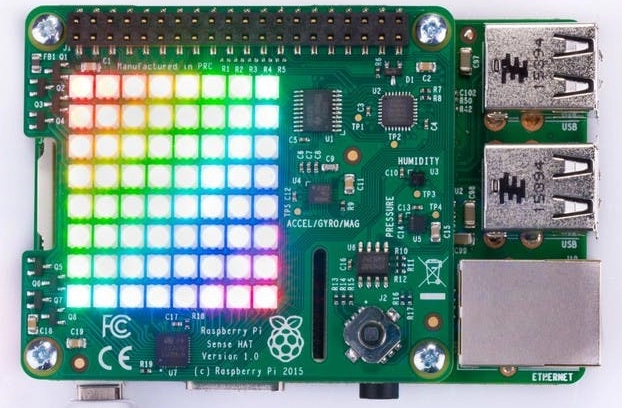
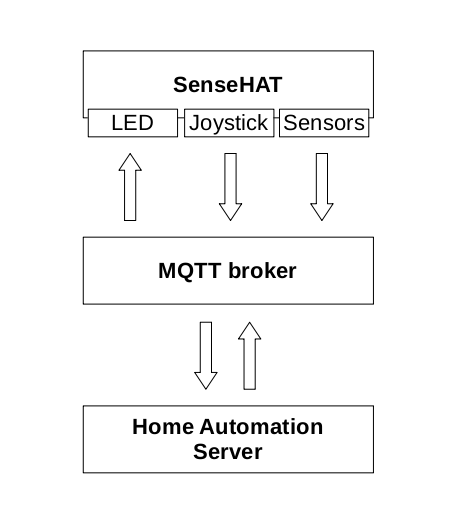
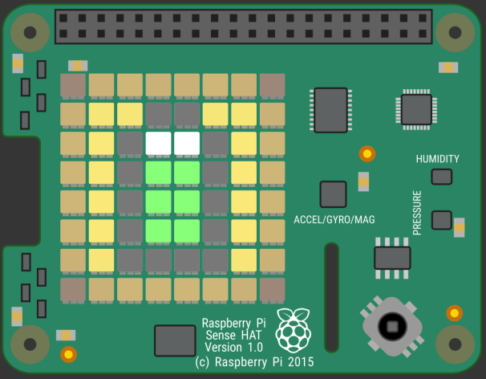

# rpi-sensehat-mqtt

This a Python application for the [Raspberry Pi](https://www.raspberrypi.com) (RPi) that allows interfacing with the [SenseHAT](https://www.raspberrypi.com/products/sense-hat/) over [MQTT](https://en.wikipedia.org/wiki/MQTT).

<p align="center"></p>

Of note, the project is a fork of [mirkodcompataretti's rpi-sense-hat](https://github.com/mirkodcomparetti/rpi-sensehat_mqtt) that ended up being heavily modified to reflect my own idea of implementation, which can be illustrated as follows:

<p align="center"></p>

That is, the `rpi-sensehat-mqtt` application publishes **sensor** and **joystick** data to the MQTT broker to be consumed by a home automation server (e.g., [Home Assistant](https://www.home-assistant.io/)). In addition, it also subcribes to an **LED** topic to display payloads published to the broker. For instance, when an home automation publishes a message to the LED topic, the SenseHAT will consume it and display on the LED matrix.

## Table of Contents

1. [Install](#install)
1. [Usage](#usage)
1. [Run as a Service](#run-as-a-service)
1. [Log Rotation](#log-rotation)
1. [Home Automation](#home-automation)
1. [Emulator](#emulator)
1. [Related Docs](#related-docs)

## Install

This application can be installed in two non-exclusive ways. In the first and more typical scenario, you own a [SenseHAT module](https://www.raspberrypi.com/products/sense-hat/) and a compatible [RPi board](https://www.raspberrypi.com/products/) and want to use `rpi-sensehat-mqtt` to interface with the SenseHAT over MQTT. In the second and less typical case, you either do not own a RPi or the SenseHAT or both but you want to run a *virtual* SenseHAT on your Linux desktop environment and interface with it over MQTT. If your case is latter one, then take a look at the section [Emulator](#emulator); otherwise, keep on reading.

For the installation procedure, it is assumed that your Raspberry Pi is running the latest version of the [Raspberry Pi OS](https://www.raspberrypi.com/software/) but the instructions might be compatible with similar distributions for the RPi. To install and use `rpi-sensehat-mqtt`, follow the procedures detailed next:

1. If you have not attached the SenseHAT to the RPi yet, go ahead and turn off your RPi and attach the SenseHAT to it.  It is strongly recommended to use a [male-to-female, 40-pin GPIO extension cable](https://duckduckgo.com/?q=rpi+40-pin+gpio+extension+cable) to connect your SenseHAT to the RPi; otherwise, sensor data **will be unreliable** due to the close proximity to the RPi, which has multiple heat sources (e.g., CPU). Then, log into the CLI of your RPi using your standard user (e.g., `pi`) or if running a desktop environment, open a terminal.

1. Run the commands below to install the `sense-hat` package and other packages we will need. Make sure that `I2C` was enabled afterwards; Otherwise, run `sudo raspi-config` and manually turn it on in the `Interfaces` section of the utility.  You will need to reboot your RPi for the changes to take effect.

    ```sh
    sudo apt update
    sudo apt install sense-hat git python3 python3-pip
    # reboot for the changes to take effect
    sudo reboot now
    ```

1. Test the `sense-hat` installation by running one or more of the Python demos at `/usr/src/sense-hat/examples/python-sense-hat` (press `ctrl+c` to stop):

    ```sh
    python3 /usr/src/sense-hat/examples/python-sense-hat/rainbow.py
    ```

1. (Optional.) [Callibrate the magnetometer](https://www.raspberrypi.com/documentation/accessories/sense-hat.html#calibration). This will install *many* additional packages and will take some time to complete.

1. Go to your user's home directory and clone this repository:

    ```sh
    cd ~
    git clone https://github.com/cgomesu/rpi-sensehat-mqtt.git
    cd rpi-sensehat-mqtt/
    ```

1. Update Python's package manager (`pip`) and install the required packages from `requirements.txt`:

    ```sh
    pip3 install --upgrade pip
    pip3 install -r requirements.txt
    ```

    You might notice that this will install the additional packages in your user's `~/.local/bin` directory, so they will not be available globally, which is good. The drawback is that `~/.local/bin` is not part of the default `$PATH`, which is where your OS will look for executables. To fix this in the current session, run the following:

    ```sh
    export PATH="$PATH:$HOME/.local/bin"
    ```

    To make `~/.local/bin` reachable to your user permanently, you need to append `export PATH="$PATH:$HOME/.local/bin"` to your `~/.bashrc` or `~/.profile`.

1. Finally, edit the `CONFIG.ini` file to match your preferences. This is were most of the configuration options are stored for users to edit.

    ```sh
    cd ~/rpi-sensehat-mqtt/
    nano CONFIG.ini
    ```

You should be all set at this point. Head to [Usage](#usage) to learn the specifics about how to run the main logic and interface with the SenseHAT via MQTT.

[top](#table-of-contents)

## Usage

The main logic is in the `rpi_sensehat_mqtt.py` script and most of the configurable variables (e.g., MQTT address and credentials, sensor publish resolution) are in the `CONFIG.ini` [INI](https://en.wikipedia.org/wiki/INI_file) file.  **You must edit the latter before running the former**.  (Advanced usage variables can be found in `src/constants/constants.py` and as constants in individual modules. Do not change them unless you know what you are doing.)

The main script can be executed in two ways, namely by using the shebang or calling `python3` directly:

```sh
./rpi_sensehat_mqtt.py
```

```sh
python3 rpi_sensehat_mqtt.py
```

However, if you run the main script from the CLI, you might notice that it won't output any meaningful messages there. Instead, all messages are logged into `logs/rpi_sensehat_mqtt.log`. So, if this is the first time running the script or you are still configuring its options, then open another terminal and make it follow new messages added to the log file whil you run the main logic:

```sh
tail -f ~/rpi-sensehat-mqtt/logs/rpi_sensehat_mqtt.log
```

Then, go back to the previous terminal and run the main script. Your SenseHAT should disaply the `welcome_message` on the LED matrix once it has initialized.

If the application closes without you sending an interrupt signal (e.g., `ctrl+c`), there's likely a configuration issue.  Check the log messages to learn about what the script is doing and any error messages.  By default, it will only store `INFO` level messages.  If you need a more verbose log, edit `LOG_LEVEL` to `'DEBUG'` instead.

Once you get the application running successfully, take a look at [Run as a Service](#run-as-a-service) and [Log Rotation](#log-rotation) to make it run automatically in the background and have your OS manage the log file. The specifics about the MQTT payloads are described next.

### MQTT

The main purpose of this application is to interface with the SenseHAT via [MQTT](https://en.wikipedia.org/wiki/MQTT). By default, it will publish/subscribe to the following topic level structure:

```mqtt
zone/room/client_name
```

in which `zone`, `room`, and `client_name` can be configured in `CONFIG.ini`. For example, if the `CONFIG.ini` contains

```ini
zone = downstairs
room = livingroom
client_name = sensehat01
```

then the application will publish/subscribe to the following topic:

```mqtt
downstairs/livingroom/sensehat01
```

As outlined before, the application creates three independent connections with the MQTT broker, namely (a) one to publish sensor data, (b) one to publish joystick directions, and (c) one to subscribe to a LED matrix sub-topic. In all three cases, payloads must be in [JSON](https://en.wikipedia.org/wiki/JSON#Syntax) (or be a `dict` or key:value pairs) data format.  The specifics of each are explained next.

- The payload of the **sensor** connection is published to the following subtopic `sensor/status`, as follows:

    ```mqtt
    downstairs/livingroom/sensehat01/sensor/status
    ```

    and has the following structure:

    ```json
    {
        "time" : "time_value",
        "pressure" : "pressure_value",
        "temperature" : {
            "from_humidty" : "temp_value",
            "from_pressure" : "temp_value"
        },
        "humidity" : "humidity_value",
        "gyroscope" : {
            "pitch" : "pitch_value",
            "roll" : "roll_value",
            "yaw" : "yaw_value"
        },
        "compass" : {
            "north" : "north_value"
        },
        "acceleration" : {
            "x" : "x_value",
            "y" : "y_value",
            "z" : "z_value"
        },
    }

    ```

- The payload of the **joystick** connection is published to the following subtopic `joystick/status`, as follows:

    ```mqtt
    downstairs/livingroom/sensehat01/joystick/status
    ```

    and has the following structure:

    ```json
    {
        "direction" : "direction"
    }
    ```

- Finally, the **LED** connection subscribes to the following subtopic `led/cmd`, as follows:

    ```mqtt
    downstairs/livingroom/sensehat01/led/cmd
    ```

    and it consumes payloads with the following structure:

    ```json
    {
        "led_method" : {
            "arg1" : "value1",
            "arg2" : "value2",
            "argN" : "valueN",
        }
    }
    ```

    in which `led_method` is the name of a valid [LED matrix setter method of a SenseHat object](https://pythonhosted.org/sense-hat/api/#led-matrix) (e.g., `"show_message"`); the various `"arg"` keys are the name of valid arguments (`text_string`, `text_colour`); and `value` is the value that each argument should be set to (`"Hello!"`, `[255,0,0]`).  This is organized in such a way because the logic will check whether the `led_method` is valid and then pass its value as `**kwargs` to the method.

    Of note, the payload can contain more than one method as well:

    ```json
    {
        "led_method1" : {
            "arg1" : "value1",
        },
        "led_method2" : {
            "arg1" : "value1",
            "arg2" : "value2"
        }
    }
    ```

    Here is an example of payload consumed by the LED client and what it displays on the LED matrix as a result:

    ```json
    {
        "load_image" : {
            "file_path" : "/home/pi/rpi-sensehat-mqtt/assets/battery/battery-75.png",
        }
    }
    ```

    <p align="center"></p>

    (Other battery states I made are in `assets/battery/`. Check `assets/pixel_art/` for addtional images that can be displayed on the LED matrix.)

[top](#table-of-contents)

## Run as a Service

To run `rpi_sensehat_mqtt.py` in the background, you can make use of the systemd unit file in the `systemd/` dir. To enable and start it, follow these instructions:

1. (Optional.) Edit the unit file to your liking and **double check the paths** to ensure they are pointing to the right ones--namely, check the paths in `ExecStart`.

    ```sh
    cd ~/rpi-sensehat-mqtt/systemd/
    nano rpi_sensehat_mqtt.service
    ```

1. Enable the unit file and start it (requires `root` permission):

    ```sh
    sudo systemctl enable "$HOME"/rpi-sensehat-mqtt/systemd/rpi_sensehat_mqtt.service
    sudo systemctl start rpi_sensehat_mqtt.service
    ```

1. You may check its status afterwards:

    ```sh
    systemctl status rpi_sensehat_mqtt.service
    ```

    And remember to take a look at its logs if the service is not running correctly.

If the service is up and running, you are all set here.

[top](#table-of-contents)

## Log Rotation

The `rpi_sensehat_mqtt.py` script stores log messages in the `logs/rpi_sensehat_mqtt.log` file and if unchcked, such a file will grow forever. You can always manually remove old entries but this is best done by making use of your OS log rotation utility, namely [`logrotate`](https://linux.die.net/man/8/logrotate). To do so, follow the steps next:

1. (Optional.) Edit the preconfigured logrotate file to your liking. Of note, if you're not following the guide here and placed the log files elsewhere, make sure to point to their correct location in the logrotate file.

    ```sh
    cd ~/rpi-sensehat-mqtt/logrotate.d/
    nano rpi_sensehat_mqtt
    ```

1. (Optional.) Test your logrotate cofiguration file:

    ```sh
    logrotate -d rpi_sensehat_mqtt
    ```

    which should print something like this:

    ```sh
    WARNING: logrotate in debug mode does nothing except printing debug messages!  Consider using verbose mode (-v) instead if this is not what you want.

    reading config file ../logrotate.d/rpi_sensehat_mqtt
    Reading state from file: /var/lib/logrotate/status
    error: error opening state file /var/lib/logrotate/status: Permission denied
    Allocating hash table for state file, size 64 entries

    Handling 1 logs

    rotating pattern: /home/pi/rpi-sensehat-mqtt/logs/rpi_sensehat_mqtt.log
    weekly (3 rotations)
    empty log files are not rotated, log files >= 1048576 are rotated earlier, old logs are removed
    considering log /home/pi/rpi-sensehat-mqtt/logs/rpi_sensehat_mqtt.log
    Creating new state
    Now: 2023-01-03 11:39
    Last rotated at 2023-01-03 11:00
    log does not need rotating (log has already been rotated)
    ```

1. Create a symlink of logrotate file to the directory monitored by `logrotate` and change the ownership to `root` (this requires `root` permission):

    ```sh
    sudo ln -s "$(pwd)"/rpi_sensehat_mqtt /etc/logrotate.d/rpi_sensehat_mqtt
    sudo chown root rpi_sensehat_mqtt
    ```

That is it. The log file should be rotated automatically during the next logrotate run--this is usually done automatically by your OS.

[top](#table-of-contents)

## Home Automation

In this section, I described how to integrate `rpi-sensehat-mqtt` with a few home automation applications.

### Home Assistant

In [Home Assistant](https://www.home-assistant.io/) (HASS), there are [many ways to integrate with MQTT devices](https://www.home-assistant.io/integrations/mqtt/).  For [manual MQTT integrations](https://www.home-assistant.io/integrations/mqtt/#manual-configured-mqtt-items), one must edit the `configuration.yaml` file to add new `mqtt:` YAML entries for the device. To illustrate, we can create a new sensor entity for *pressure* and *temperature from humidity* by adding the following to the HASS `configuration.yaml`:

```yaml
# Example configuration.yaml entry
mqtt:
  sensor:
    - name: "SenseHAT - Pressure"
      state_class: measurement
      device_class: pressure
      state_topic: "downstairs/livingroom/sensehat01/sensor/status"
      unit_of_measurement: "hPa"
      value_template: |-
        {{ value_json.pressure }}
    - name: "SenseHAT - Temperature"
      state_class: measurement
      device_class: temperature
      state_topic: "downstairs/livingroom/sensehat01/sensor/status"
      unit_of_measurement: "°C"
      value_template: |-
        {{ value_json.temperature.from_humidity }}
```

Interacting with the **led** device, however, is a little bit more complicated because you need to configure HASS to send specific payloads (see [Usage](#usage)). This is best done by first writing [Scripts](https://www.home-assistant.io/integrations/script/) in your HASS instance that make use of the `mqtt.publish` service.  Then, whenever customizing your dashboard or automation, you can call such scripts to publlish the desired payloads.  Here is an example of script to turn off the LED matrix:

```yaml
# Example configuration.yaml entry
script:
  sensehat_led_clear:
    alias: 
    sequence:
      - service: mqtt.publish
        data:
          topic: "downstairs/livingroom/sensehat01/led/cmd"
          payload: |-
            {"clear" : ""}
          retain: false
```

Now you can call the `sensehat_led_clear` script from within your HASS dashboard (or via an automation) in order to clear the LED matrix on the SenseHAT.

[top](#table-of-contents)

## Emulator

If you do not own a RPi or a SenseHAT or both, you can emulate the SenseHAT on pretty much any system via the [SenseHAT Emulator](https://github.com/astro-pi/python-sense-emu/). This is particularly useful for development but you can also use your virtual SenseHAT to send (and to receive) messages from the MQTT broker just as if you had a physical SenseHAT. Check the [`sense-emu` installation instructions](https://sense-emu.readthedocs.io/en/v1.1/install.html?highlight=cairo#alternate-platforms) and give it a try.

In `apt` based distros (e.g., Debian, Ubuntu, Rasbperry Pi OS), this can be done via terminal as follows:

- Install prerequisites:

    ```sh
    sudo apt install python3 python3-pip python3-gi python3-gi-cairo
    ```

- Install `sense-emu` via `pip3` for the current user:

    ```sh
    pip3 install --upgrade pip
    pip3 install sense-emu
    ```

- Ensure that `$HOME/.local/bin` is reachable in your user's `$PATH`:

    ```sh
    export PATH="$PATH:$HOME/.local/bin"
    ```

- (Optional.) The command above will only make your user's `.local/bin` dir reachable for the duration of the current session. To permanently add it to your `$PATH`, append the command to your `~/.bashrc` or `~/.profile`.

- Lunch the SenseHAT GUI:

    ```sh
    sense_emu_gui &
    ```

- Now in your `rpi-sensehat-mqtt` dir, set (edit and save) `SENSEHAT_EMULATION` in `src/constants/constants.py` as follows:

    ```Python
    SENSEHAT_EMULATION = True
    ```

You are done. Now just run `rpi-sensehat-mqtt.py` as described in [Usage](#usage) and interface with the SenseHAT via the GUI (`sense_emu_gui`).

[top](#table-of-contents)

## Related Docs

- [RPi SenseHAT](https://www.raspberrypi.com/documentation/accessories/sense-hat.html)
- [SenseHAT Python API](https://pythonhosted.org/sense-hat/)
- [SenseHAT Emulator](https://github.com/astro-pi/python-sense-emu/)

[top](#table-of-contents)
